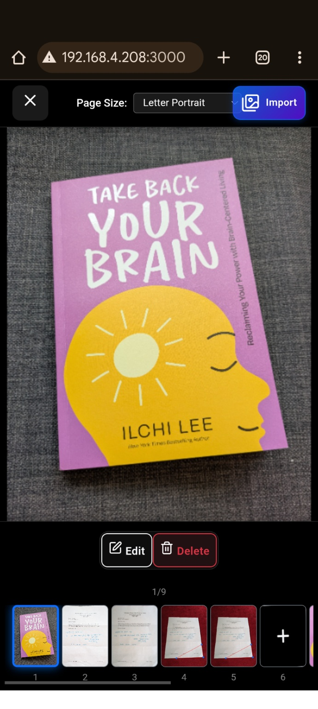
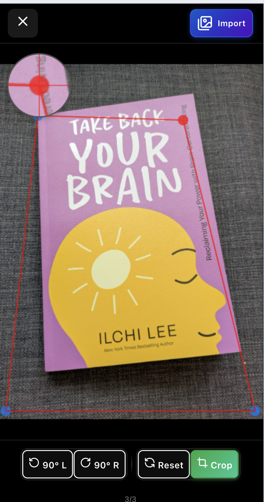

# Vue 3 DocumentScanner Component

A comprehensive Vue 3 component for document scanning with OpenCV.js integration, featuring mobile-optimized camera access, image processing, corner detection, and PDF generation.

## Features

- 📱 **Mobile-Optimized**: Works seamlessly on mobile devices with camera access
- 🔍 **Document Detection**: Automatic corner detection using OpenCV.js
- 🖼️ **Image Processing**: Perspective correction, rotation, and enhancement
- 📄 **PDF Generation**: Multi-page PDF creation from scanned documents
- 🎛️ **Flexible Configuration**: Customizable OpenCV.js URL and component props
- 🧪 **Comprehensive Testing**: Unit and browser tests with Vitest

## Installation

```bash
npm install document-scanner-vue
```

### Peer Dependencies

You also need to install the required peer dependencies:

```bash
npm install vue@^3.4.0 jspdf@^3.0.0 @vueuse/core@^13.0.0
```

### CSS Import

**Important**: You must import the CSS file in your main application:

```js
// In your main.js or main.ts
import 'document-scanner-vue/dist/style.css'
```

## Development

### Development Server

Start the development server with the sample page:

```bash
npm run dev
```

This will:
1. Install dependencies in the `dev/` directory
2. Start a Vite development server
3. Open a comprehensive testing interface at `http://localhost:3000`

### Testing

#### Unit Tests
Run unit tests with mocked dependencies:

```bash
npm run test:unit          # Run once
npm run test:unit:watch    # Watch mode
```

#### Browser Tests
Run browser tests with real OpenCV.js:

```bash
npm run test:browser       # Run once
npm run test:browser:watch # Watch mode
```

#### All Tests
```bash
npm run test:all           # Run both unit and browser tests
npm run test:coverage      # Run with coverage report
npm run test:ui            # Open Vitest UI
```

## Usage

### Basic Usage

```vue
<template>
  <DocumentScanner 
    @pdf-created="handlePdfCreated"
  />
</template>

<script setup>
import DocumentScanner from './src/DocumentScanner.vue'

const handlePdfCreated = (pdfBlob) => {
  // Handle the generated PDF
  console.log('PDF created:', pdfBlob)
}
</script>
```

### Advanced Configuration

```vue
<template>
  <DocumentScanner 
    :button-size="'lg'"
    :close-after-pdf-created="false"
    :label="'Scan Document'"
    :open-cv-url="'/path/to/opencv.js'"
    @pdf-created="handlePdfCreated"
  />
</template>
```

### Props

| Prop | Type | Default | Description |
|------|------|---------|-------------|
| `buttonSize` | `'sm' \| 'md' \| 'lg'` | `'lg'` | Size of the scan button |
| `closeAfterPdfCreated` | `boolean` | `false` | Whether to close scanner after PDF creation |
| `label` | `string` | `'Scan Document'` | Button label text |
| `openCvUrl` | `string` | `undefined` | Custom OpenCV.js URL (uses latest stable if not provided) |

### Events

| Event | Payload | Description |
|-------|---------|-------------|
| `pdf-created` | `Blob` | Emitted when PDF is successfully generated |

## OpenCV.js Configuration

The component automatically loads the latest stable OpenCV.js version (4.10.0) by default. You can customize this:

```vue
<!-- Use default latest stable -->
<DocumentScanner />

<!-- Use custom URL -->
<DocumentScanner open-cv-url="https://custom-cdn.com/opencv.js" />

<!-- Use local file -->
<DocumentScanner open-cv-url="./assets/opencv.js" />

<!-- Use relative path -->
<DocumentScanner open-cv-url="/public/opencv.js" />
```

## Testing Architecture

### Unit Tests (`tests/unit/`)
- **Environment**: jsdom
- **Mocks**: OpenCV.js, DOM APIs, File APIs
- **Focus**: Component logic, composables, utilities
- **Fast execution**: No real OpenCV.js loading

### Browser Tests (`tests/browser/`)
- **Environment**: Real browser (Playwright)
- **Real OpenCV.js**: Loads actual OpenCV.js library
- **Focus**: Integration testing, real image processing
- **Slower execution**: Full OpenCV.js initialization

### Test Files Structure

```
tests/
├── setup.ts                 # Unit test setup with mocks
├── browser-setup.ts         # Browser test setup with real OpenCV.js
├── unit/
│   ├── useOpenCV.spec.ts    # OpenCV composable tests (using vue-opencv-composable package)
│   ├── DocumentScanner.spec.ts # Component tests
│   └── usePageManager.spec.ts  # Page management tests
└── browser/
    └── opencv-integration.browser.spec.ts # Real OpenCV.js tests
```

## Development Environment

The `dev/` directory contains a complete development environment:

- **Real Component Integration**: Uses the actual DocumentScanner component
- **Live Configuration**: Adjust props in real-time
- **Debug Tools**: Component state inspection, OpenCV status monitoring
- **Mobile Testing**: Network access for device testing
- **Test Functions**: File input, camera access, OpenCV functionality

### Mobile Testing

Access the development server from mobile devices:

1. Start the dev server: `npm run dev`
2. Note the network URL (e.g., `http://192.168.1.100:3000`)
3. Open the URL on your mobile device
4. Test camera functionality and touch interactions

## Project Structure

```
src/
├── DocumentScanner.vue      # Main component
├── composables/
│   ├── useOpenCV.ts        # OpenCV.js integration (now using vue-opencv-composable package)
│   ├── usePageManager.ts   # Page state management
│   └── useImageProcessing.ts # Image processing utilities
├── utils/
│   ├── opencvUtils.ts      # OpenCV.js utilities
│   └── imageProcessing.ts  # Image processing functions
└── types/
    └── index.ts            # TypeScript type definitions

dev/                        # Development environment
├── App.vue                 # Development interface
├── main.ts                 # Vue app initialization
├── index.html              # HTML entry point
├── package.json            # Dev dependencies
├── vite.config.ts          # Vite configuration
└── README.md               # Development guide

tests/                      # Test suite
├── setup.ts                # Unit test setup
├── browser-setup.ts        # Browser test setup
├── unit/                   # Unit tests
└── browser/                # Browser integration tests
```

## Build

```bash
npm run build              # Build for production
npm run build:types        # Generate TypeScript declarations
npm run preview            # Preview production build
```

## Bundle Analysis

Monitor and analyze bundle size:

```bash
npm run analyze            # Build and open bundle analyzer
npm run size               # Show file sizes in terminal
```

Current bundle sizes (after optimizations):
- **ES Module**: 124KB (32KB gzipped)
- **CommonJS**: 95KB (28KB gzipped)  
- **CSS**: 34KB (6KB gzipped)

### Bundle Size Strategy

This library uses several strategies to minimize bundle size:

1. **External Dependencies**: Large libraries like `jsPDF` and `@vueuse/core` are peer dependencies
2. **Tree Shaking**: Only import what you use
3. **CSS Code Splitting**: Disabled to create single CSS file
4. **Source Maps**: Available for debugging

## Linting & Type Checking

```bash
npm run lint               # ESLint
npm run type-check         # TypeScript type checking
```

## Contributing

1. Fork the repository
2. Create a feature branch
3. Add tests for new functionality
4. Ensure all tests pass: `npm run test:all`
5. Submit a pull request

## License

MIT License - see LICENSE file for details.